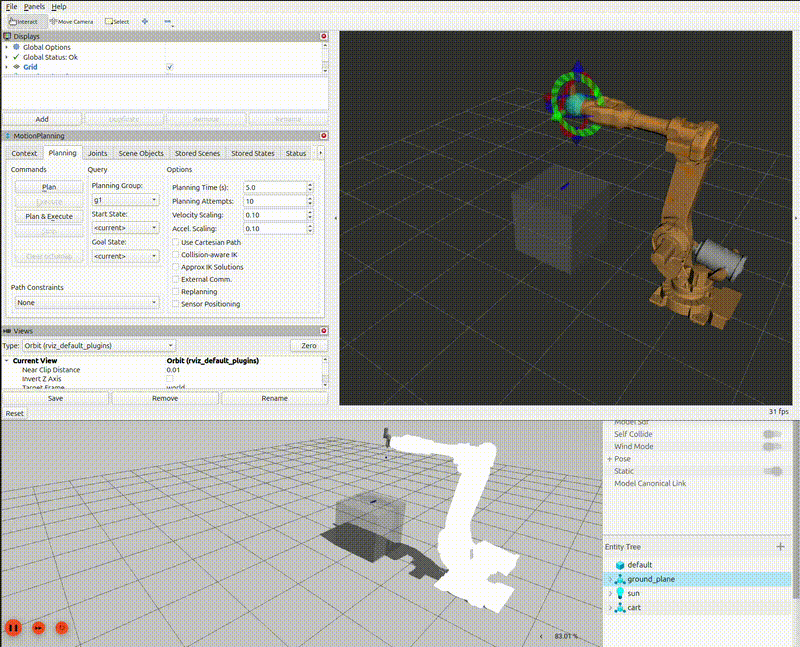

# Unscrew Simulation

## Overview

This ROS 2 project simulates a robotic arm that unscrews screws within a Gazebo simulation environment.

## Dependencies

Before getting started, ensure the following dependencies are installed:

- **ROS 2 Jazzy**
- **Gazebo Harmonic**
- **MoveIt 2**
- **ros2_control**
- **gz_ros2_control**

You can follow the official documentation for installation instructions of each dependency.

## Build

Use `colcon` to build the necessary packages:

```bash
colcon build --packages-select unscrew_simulation state_machine
```

Source your workspace after building:

```bash
source install/setup.bash
```

## Launch

To start the simulation:

```bash
ros2 launch unscrew_simulation unscrew_demo.launch.py
```

To launch the state machine task planner:

```bash
ros2 launch state_machine task_planner.launch.py
```

## Behavior

The robot will sequentially move to each screw, perform an unscrewing operation, and then return to the bin.

## License

[MIT](LICENSE)

